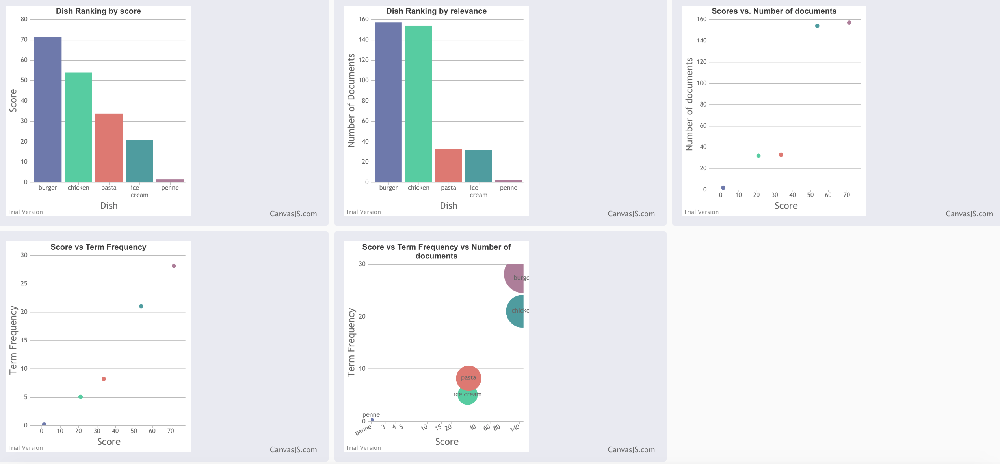
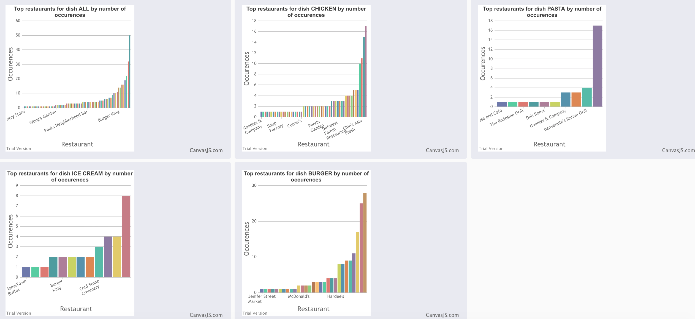

# Decipe - A recipe for ranking dishes based on customer reviews

Decipe is a ranking mechanism that utilizes machine learning to rank dishes 
in a "diner's preference" list. The list contains a series of dishes that the 
user wants to rank based on customer reviews for different restaurants.

## System Interface

The user needs to upload 3 files to initiate the ranking process.

1. A list of dishes in a text file. We call this the diner's preference.
   Each line of the file should contain the name of an individual dish name. 
   All dish names should be unique. Dish names may contain special characters
   (such as apostrophe) and spaces. 
   It is preferred not to include quotes(" or ') in dish names as most reviews
   posted by users do not contain such quotes.

   Eg.
   cheeseburger
   french fries
   chicken nuggets
   
   The dishes file must have an extension of .txt

2. A list of metadata items, each item containing information about each restaurant.
   
   Each metadata item must be in JSON format and each row must contain information 
   about only *one* restaurant.

   Eg.
   {**"business_id": "vcNAWiLM4dR7D2nwwJ7nCA"**, "full_address": "4840 E Indian School Rd\nSte 101\nPhoenix, AZ 85018", "hours": {"Tuesday": {"close": "17:00", "open": "08:00"}, "Friday": {"close": "17:00", "open": "08:00"}, "Monday": {"close": "17:00", "open": "08:00"}, "Wednesday": {"close": "17:00", "open": "08:00"}, "Thursday": {"close": "17:00", "open": "08:00"}}, "open": true, "categories": ["Doctors", "Health & Medical"], "city": "Phoenix", "review_count": 7, "name": "Eric Goldberg, MD", "neighborhoods": [], "longitude": -111.98375799999999, "state": "AZ", "stars": 3.5, "latitude": 33.499313000000001, , "type": "business"}

   The metadata must have at least one primary key that is unique for that business (in the above example, it is **business_id**)
   This primary key is important because it correlates the restaurant/business with a customer 
   review that also contains the same key (as is shown in the next section)
   
   The file extension for this upload must be .json

3. A list of customer reviews for any/all of the businesses specified in (2).
   
   Each review item must be in JSON format and each row of the file must contain information 
   about only *one* review.

   Eg.
   {"votes": {"funny": 0, "useful": 2, "cool": 1}, "user_id": "Xqd0DzHaiyRqVH3WRG7hzg", "review_id": "15SdjuK7DmYqUAj6rjGowg", "stars": 5, "date": "2007-05-17", "text": "...review text here ...", "type": "review", **"business_id": "vcNAWiLM4dR7D2nwwJ7nCA"**}

   The review shown above correlates to the business described in (2) through the "business_id" 
   field whose values are identical in both places.

    

----------

## Ranking

The ranking process takes into account multiple factors related to frequency, length, relevance and sentiment of reviews into account and comes up with scores that are displayed on the dashboard.
The user may ignore the actual values of the scores in the rendered charts. The magnitude of the difference in length between different elements of a chart shows the relative standing of the individual elements with respect to each other.

- length of bars (in bar charts)
- size of bubbles (in bubble charts)
- pairwise trend (in scatter charts)
- length of columns (in column charts)

----------

## Rendering

There are two groups of charts - one for dishes and the other for reviews.
The dishes group renders scoring information of dishes and their positioning in the overall search space.
The restaurant group renders scoring information of restaurants and their positioning with respect to each dish. For example, a restaurant chart for the 'cheeseburger' group only contains top restaurants carrying the menu item "cheeseburger" and evaluates each restaurant with respect to their popularity of the "cheeseburger" dish.

There is a dish called "all" that takes into account the **entire** diner's preference into account when ranking restaurants.

----------

## File size limits

- Dishes file: Kindly limit to 20 items for maximum performance
- Reviews file: Kindly limit to 500MB for maximum performance
- Businesses file: Kindly limit to 50MB for maximum performance

----------

## Progress bars

There are three stages of progress after user uploads their documents

Around 40% == Dishes being uploaded/processed
Around 70% == The ranker has finishes ranking the dishes
100% == Visualization is complete!

----------

## Visualization

Here are some sample charts that were generated from some example documents.

Dish Ranking

Restaurant Ranking

----------

## Enjoy!